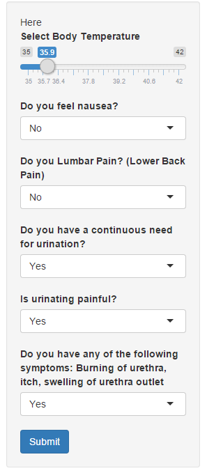
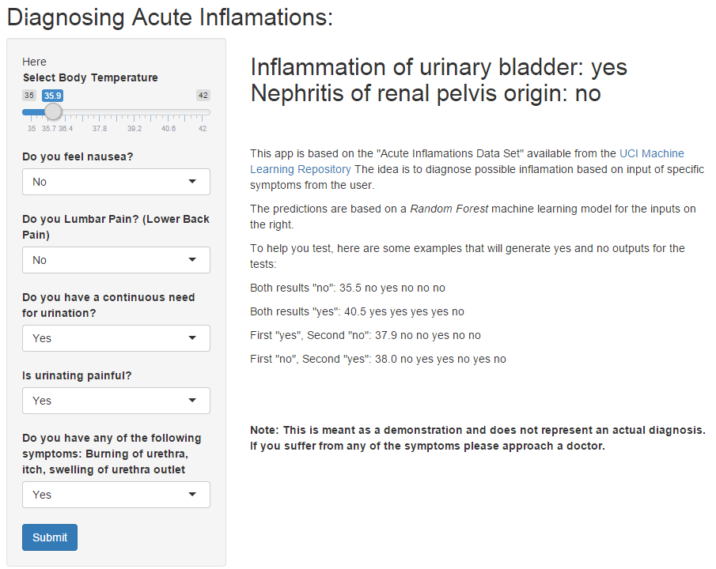

blish---
title       : Diagnosing Acute Inflamation
subtitle    : A Machine Learning Approach
author      : Aneesh R. Sathe
 
framework   : io2012        # {io2012, html5slides, shower, dzslides, ...}
highlighter : highlight.js  # {highlight.js, prettify, highlight}
hitheme     : tomorrow      # 
widgets     : []            # {mathjax, quiz, bootstrap}
mode        : selfcontained # {standalone, draft}
knit        : slidify::knit2slides
---

## Using key symptoms to diagnose inflamation  

* Here we demonstrate that using data from expert doctors and a few symptoms we can help predict the most likely diagnosis 
* Specifically, we demonstrate that using a handful of symptoms acute inflammations can be diagnosed.  
<div style='text-align: center;'>
    
</div>


---

## Using Machine Learning for Complex Diagnosis  

* At the heart of the model is a random forest model that was fit to data available on the UCI machine learning website. 
* With our test symptoms we get an accuracy of near 100% for diagnosing both:
    + Inflammation of urinary bladder
    + Nephritis of renal pelvis origin
        
```{r ,out.height= 10}
library(caret)
pro_in_dat=read.table("diagnosis.data", fileEncoding="UTF-16", dec=",")

colnames(pro_in_dat)=c('temp','naus','LumPain','UrinePushing','MictPain','burning','BladInflm','Nephritis')
blad_in=pro_in_dat[,1:7]
neph_in=pro_in_dat[,c(1:6,8)]

BinTrain <- createDataPartition(y=blad_in$BladInflm,p=0.8, list=FALSE)
Btraining <- blad_in[BinTrain,]
Btesting <- blad_in[-BinTrain,]
```


---

## Generating the model
* Random Forest was applied to training data and then tested for accuracy on testing data.
* Given that this is very clean data the accuracy was 100%. This will be slightly lower due to out of sample factors. 
```{r,out.height=5}
library(randomForest)
BmodFit=randomForest(BladInflm~.,data=Btraining)
Bpred_tr=predict(BmodFit,Btraining[,1:6])
confusionMatrix(Bpred_tr,Btraining$BladInflm)
```

---

## Extendible to other diagnosis? 

* This proof of concept app demonstrates that datasets from experts can be used to generate accurate diagnosis.
* Checkout the app [HERE](https://aneeshsathe.shinyapps.io/InfPred)

<div style='text-align: center;'>
    
</div>


